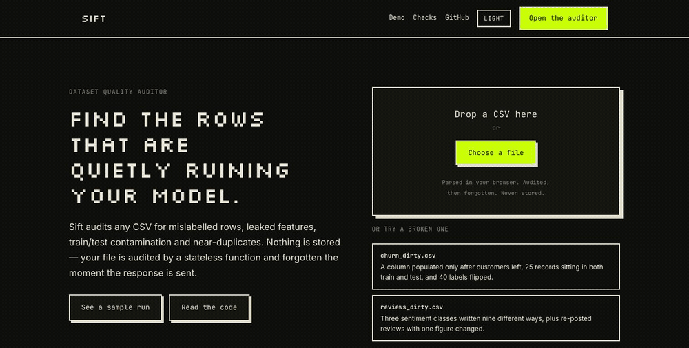

# Sift

Sift cleans a messy CSV without the notebook. Drop a file in and it runs twenty-nine checks, fixes the unambiguous problems in one click, and hands you the rest with the row numbers and a reason.

Live: `<url>` · Sample datasets load from the empty state, so you can try it without uploading anything.



## Why I built it

Every new dataset meant the same half hour. Read it in, check the dtypes, count the nulls, find the duplicates, discover the category column has four spellings of the same value, write the same six lines I wrote last month, lose the notebook, write them again for the next file.

None of it is difficult. It is repetitive enough that people skip it, and the faults worth catching hide behind the boring ones: a column that quietly contains the answer, a few hundred rows labelled wrong, the same records sitting in both the training and test split. I wanted the repetitive part done in one click and the interesting part surfaced rather than buried, and I wanted to write the detection logic myself rather than call an API and hope.

The split the tool draws is between fixes that need a decision and fixes that do not. Duplicates, spelling variants, columns that never vary and rows that are more than half empty get applied together on one button, because there is no judgement in any of them. Everything else, meaning the leaked column, the contaminated rows and the model's opinion about your labels, is shown with its evidence and left alone until you say so.

## What it checks

Twenty-nine checks, grouped by what they look at.

At the dataset level it finds exact duplicate rows, near-duplicate rows, class imbalance, rows that appear on both sides of a train/test split, and a totals row sitting at the bottom pretending to be a record. At the column level: missing values, constant and near-constant columns, ID-like columns sitting in the feature set, mixed types in one column, categorical values that differ only by case or whitespace, rare categories, numeric outliers, implausible values, redundant column pairs, and single-column label leakage.

Then the formatting half, which is most of what a hand-written cleaning script spends its lines on: words standing in for a missing value, numbers wearing a currency symbol or a unit, one column written in three date formats, true and false spelled six ways, a number like -999 used to mean "no reading", one company named four different ways, characters with no width sitting inside a value, and HTML left attached to scraped text. Two more read relationships between columns rather than values inside one: a column determined by another, and a column that is the sum or product of two others. Both can fill a gap by deduction rather than by guessing. One reports rows that break an order the rest of the file keeps, like a ship date before its order date.

At the row level, one check: labels the model disagrees with.

Each finding comes back with a severity, a sentence explaining what it means and why it matters, and the row numbers it applies to. Twenty-six of the twenty-nine run without a label column. The other three say so rather than quietly returning less.

## How the interesting three work

Most of the checks are rules. These three are not, and they are the reason the project exists.

### Mislabelled rows

Training a model on a dataset and then asking it which rows look wrong does not work, because the model has already memorised those rows. So Sift uses 5-fold cross-validated predictions instead. Every row gets scored by a model that never saw it during training.

For each row I take the probability the model assigned to the label the row actually has, and the highest probability it assigned to anything. When the first number is low and the second is high, the model is confident and it disagrees with you. The gap between them is the ranking score.

Two guardrails matter here. Classes with fewer than five members get dropped before cross-validation, because stratified 5-fold cannot split them and the failure is silent. And the overall cross-validation accuracy comes back with the results. If the model only scored 0.55, it cannot model your task, and every flag it produced is noise. Sift prints that number next to the flags rather than hiding it.

### Leaked features

Sift fits a depth-3 decision tree on each column on its own and cross-validates it. If a single column predicts your target far better than guessing the biggest class, that column is not a strong feature. It is the answer copied into the input, usually because it was populated after the outcome was known.

The check compares against the majority-class baseline rather than a flat number. Without that, a label that is 99% one value makes every column look like a leak.

This is the cheapest check in the whole tool and it has caught the most interesting things during testing.

### Train/test contamination

If a split column exists, Sift looks for rows that appear on both sides, exactly and approximately. Exact matches come from hashing the feature columns and grouping. Near matches reuse the duplicate detection below.

Contamination is the failure that produces the most confident wrong result, because the validation score comes back high and there is nothing in the training curve to suggest anything went wrong.

### A note on near-duplicates, because I got this wrong first

My first attempt encoded every row into one feature matrix (text through TF-IDF and SVD, numbers rank-scaled, categories one-hot encoded), normalised it, and compared rows by cosine similarity. It returned 27,595 near-duplicate pairs on a dataset where I had planted 20.

The problem is not the threshold. With a handful of one-hot columns, two unrelated rows already sit at a median cosine of 0.51, and the 99th percentile is 0.956. There is no cut point that separates real duplicates from coincidence. Centering the matrix first, which makes cosine behave like a correlation, drops unrelated pairs to a median of −0.03 and still leaves roughly 1,180 false pairs at 0.99.

So I changed the question. A near-duplicate is the same record entered twice: every field agrees except one, and that one is close rather than different. Candidates come from hashing each leave-one-column-out view of the frame, which is linear in the row count instead of quadratic, and the pairwise comparison only ever runs inside a bucket already known to agree on everything else. The single differing field is then judged by its type: a number within tolerance of the column's spread, text above a similarity threshold, anything else equal after normalising case and whitespace.

That took the same dataset from 27,595 pairs to all 20 planted pairs and nothing else.

## The thresholds I chose and why

There are five numbers in `api/sift/config.py` that decide what gets flagged. I set them by sweeping each one against two sample datasets where I had injected the faults myself, so I could measure recall and false positives instead of guessing. `python scripts/tune.py` reproduces every table below.

**`NEAR_DUP_THRESHOLD = 0.70`** is the text similarity required of the one field two near-duplicate rows differ on. On the reviews data, 0.70 recovers all 50 planted rows with no false pairs. 0.75 drops to 42, 0.80 to 24, and 0.97 finds 6. I started at 0.97 and it was badly wrong, because that figure was carried over from the cosine design described above, where the threshold had to separate duplicates from the entire dataset. Once field agreement does that job, the threshold only has to confirm the differing text is close, and it can be much lower.

**`LEAKAGE_ACCURACY = 0.95`**: a column scoring above this against the label, on its own, is treated as the answer rather than a feature. The planted leak scores 0.987. The strongest honest feature in either sample is a star rating at 0.859, and the best legitimate churn feature is tenure at 0.699. Anything between 0.87 and 0.98 separates them, so I took the middle. I rejected 0.98 because it clears the planted leak by only 0.007, and a slightly weaker leak in a real dataset would slip under it.

**`MISLABEL_P_GIVEN_MAX = 0.10` and `MISLABEL_P_TOP_MIN = 0.75`**: a row is flagged when the model gives its stated label less than the first number and gives something else more than the second. At these values I get 39 of 40 planted mislabels on the churn data with no false flags, and 30 of 30 on the reviews data. Loosening to 0.20 and 0.50 recovers the fortieth row but admits two false ones. Tightening to 0.05 and 0.90 returns the same 39 and buys nothing. I would rather miss one row than start admitting rows that are fine.

**`WEAK_MODEL_ACCURACY = 0.60`**: below this the flags are still shown but tagged low confidence, because a model that cannot learn the task cannot judge its labels either. This one is a judgement call rather than a sweep. Both sample datasets sit far above it, at 0.985 and 0.930, so it fires only where a model has genuinely failed rather than merely struggled.

The tuning is easier to trust because the sample datasets are generated by `scripts/make_dirty.py`, which records the index of every fault it injects. A check is measured on recall against those indices rather than on whether it returned something.

## Watching it argue against itself

The clearest thing the tool does is undermine its own first answer. Audit the churn sample and it reports 0.985 cross-validation accuracy and flags 39 mislabelled rows. Drop the leaked column it just told you about, drop the contaminated rows, and re-audit:

```
before  ·  cv accuracy 0.985  ·  39 rows flagged
after   ·  cv accuracy 0.710  ·  108 rows flagged
```

Accuracy falls and the flag count nearly triples, because without the leak the model is genuinely uncertain and disagrees with far more rows. The first line is the one you would have believed if the tool had hidden its own accuracy. That is the whole argument for printing it next to the flags.

## What it can't do

- Files up to 50,000 rows. The browser gzips the upload and CSV compresses about five to one, so a file that size arrives in well under a megabyte. The row limit is the real one, and it is there because the audit holds the whole frame in memory.
- Classification labels only. Regression targets need a different mislabel formulation and I have not written it.
- CSV and TSV only.
- Nothing is saved. Reload the page and your work is gone. That is deliberate, not an oversight. The backend stores nothing at all.

## Running it locally

```
git clone https://github.com/vibey19/sift
cd sift
python3.12 -m venv .venv && source .venv/bin/activate
pip install -r requirements-dev.txt
npm install
```

Then two terminals:

```
uvicorn api.index:app --reload --port 8000
npm run dev
```

The Vite dev server proxies `/api` to the Python process, so the frontend calls the same paths it will in production. Tests are `pytest -q` for the backend and `npm test` for the browser code. `python scripts/make_dirty.py` regenerates the sample datasets, and `python scripts/tune.py` reproduces the threshold tables above.

Pin the virtualenv to Python 3.12. That is what the serverless runtime provides, and building locally on a newer version means wheels resolve differently in development and deployment.

## Stack

Two endpoints. `POST /api/profile` returns column types so the label picker can render, and `POST /api/audit` returns every finding. The file crosses the wire twice, once per call, which is the cost of letting you choose a label column before the label-aware checks run.

pandas and scikit-learn do everything analytical. No deep learning, no API calls, no model downloads. Text features go through TF-IDF and TruncatedSVD rather than sentence embeddings. Embeddings would be slightly better at catching paraphrased duplicates, but sentence-transformers pulls in PyTorch, which is roughly 800MB and would not deploy on a free tier. TF-IDF installs in seconds and the quality difference on this task is small.

The frontend is React with plain JSX and no framework beyond that: no router, no state library, no component library, no CSS framework. The CSV parser is written out by hand in `src/csv.js`, because the browser owns the file for the whole session and something had to parse it. Edits are kept as an append-only log and replayed over the original rows on every render, which makes undo a single pop and keeps the parsed file authoritative.

The browser holds the dataset for the whole session and every edit happens client-side, so the server is stateless by construction rather than by discipline.
